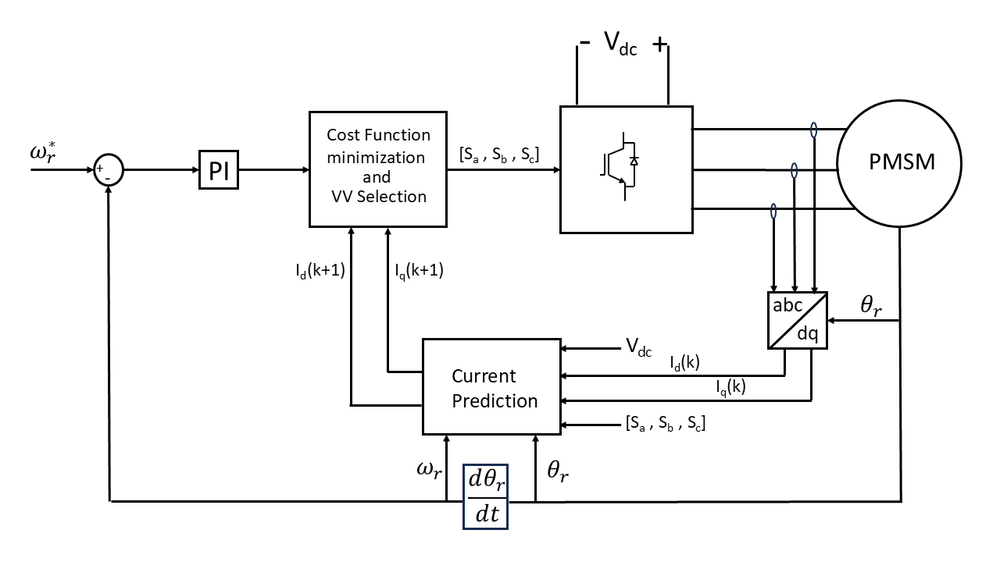

# Hybrid MPC for PMSM Drives — Repository

**Project:** A Hybrid Model Predictive Control for PMSM Drives with Common-Mode Voltage and Switching Loss Reduction.  
**Author:** Muktapuram Venkata Rohith Reddy — 22EE01003 (IIT Bhubaneswar).  
**Additional contributors:** Anugrah Gupta, Ankit Dalal, Mosaddique Nawaz Hussain.

## Overview
This repository contains the Simulink model (`.slx`) implementing a hybrid Finite-Control-Set Model Predictive Control (FCS-MPC) strategy for a Permanent Magnet Synchronous Motor (PMSM).  
The proposed controller balances three competing objectives: accurate speed/torque tracking, **common-mode voltage (CMV)** suppression, and **reduction of switching losses** by constraining transitions to adjacent switching states and using a virtual-zero-vector (VZV) synthesis when zeros are needed.  
Full project details and results are in the project report (PDF) included in the repository.

## Key Features
- Implements **Conventional MPC**, **Reduced-CMV MPC**, **Reduced-Switching MPC**, and the **Proposed Hybrid MPC** for direct comparison.  
- Bounds CMV to approximately ±Vdc/6 while eliminating CMV spikes for the hybrid method.  
- Reduces unnecessary multi-switch commutations by enforcing adjacent-single-switch transitions (when applicable), lowering switching stress.  
- Simulation results (THD, switching counts, CMV behavior) and parameter tables are provided in the report.

## Repository Contents

```
/ (root)
├─ model/ # Simulink files (your .slx)
│ └─ pmsm_mpc_simulation.slx # <-- place your SLX here (rename as desired)
├─ report/
│ └─ Final (2).pdf # Project report (included)
├─ readme_images/ # Extracted images from the PDF
│ └─ ...
├─ README.md # This file
```


## Requirements
- MATLAB + Simulink (recommended R2019b or later).  
- Simscape / Simscape Electrical (for accurate PMSM and power electronics models).  
- (Optional) Signal Processing Toolbox for THD calculations, if used in your model.

## How to run the Simulink model
1. Place the `.slx` file in the `model/` folder (rename if needed).  
2. Open MATLAB and change directory to the repository root.  
3. Open the model:  
   ```matlab
   open('model/pmsm_mpc_simulation.slx')





## Citation

If you use this work, please cite the report included in the repository.

## Contact

Muktapuram Venkata Rohith Reddy
Roll No: 22EE01003
Email: 22ee01003@iitbbs.ac.in